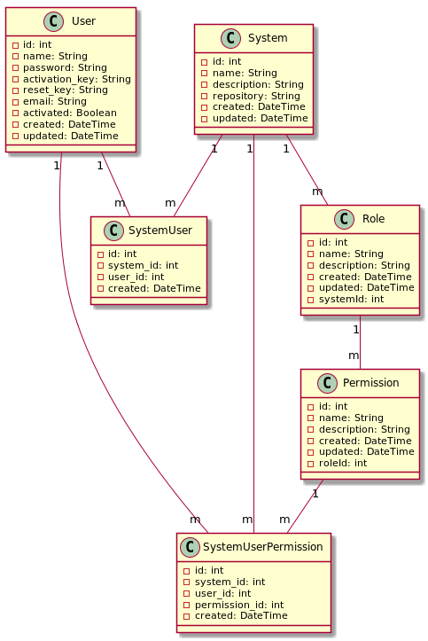

# Accesos con Golang y SQL

- [Accesos con Golang y SQL](#accesos-con-golang-y-sql)
  - [Configuraciones y Scripts](#configuraciones-y-scripts)
    - [Golang](#golang)
    - [Migraciones con DBMATE](#migraciones-con-dbmate)
    - [Imágnes de PlantUML](#imágnes-de-plantuml)
  - [Documentación](#documentación)

## Configuraciones y Scripts

### Golang

Instalar asdf (si no lo tienes)
    
    git clone https://github.com/asdf-vm/asdf.git ~/.asdf --branch v0.14.0

Agrega asdf al shell (si usas bash)

    echo -e '\n. "$HOME/.asdf/asdf.sh"' >> ~/.bashrc
    echo -e '\n. "$HOME/.asdf/completions/asdf.bash"' >> ~/.bashrc
    source ~/.bashrc

Instalar plugin de Go

    $ asdf plugin add golang https://github.com/asdf-community/asdf-golang.git

Instalar una versión de Go (ejemplo: 1.22.0)

    $ asdf install golang 1.23.0

Establecer la versión de Go global o local
  
    $ asdf global golang 1.23.0   # para todo el sistema
    $ asdf local golang 1.23.0    # para un proyecto específico

Verifica instalación
    
    go version

Instalar dependencias de go:
   
    $ go get github.com/gin-gonic/gin
    $ go get -u gorm.io/gorm
    $ go get -u gorm.io/driver/sqlite

### Migraciones con DBMATE

Instalar dependencias:

    $ npm install

Crear migración:

    $ npm run db:new <nombre-migración>

Ejecutar

    $ npm run db:up

Deshacer

    $ npm run db:rollback

Ejemplos de código en Sqlite3

```sql
-- Crear una entidad fuerte
CREATE TABLE paises (
  id INTEGER NOT NULL PRIMARY KEY AUTOINCREMENT,
  nombre VARCHAR(40) NOT NULL,
  bandera_url VARCHAR(100) NOT NULL,
  gentilicio VARCHAR(30) NOT NULL
);
-- Crear una entidad debil
CREATE TABLE recurso_coleccion (
  id	INTEGER NOT NULL PRIMARY KEY AUTOINCREMENT,
  coleccion_id INTEGER NOT NULL,
  recurso_id INTEGER NOT NULL,
  FOREIGN KEY (coleccion_id) REFERENCES coleccion (id),
  FOREIGN KEY (recurso_id) REFERENCES recurso (id)
);
```

### Imágnes de PlantUML

Generar UMLs:

    $ chmod +x render_all_puml.sh
    $ ./render_all_puml.sh

---

## Documentación

Diagrama de clases

